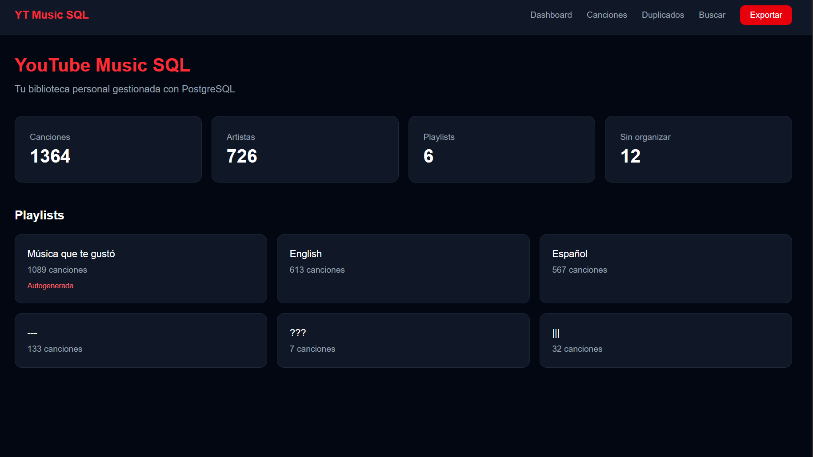

# YouTube Music SQL

Sistema en PostgreSQL para gestionar y limpiar una biblioteca personal de YouTube Music. Detecta canciones duplicadas, mantiene un respaldo automático antes de eliminar, y permite buscar antes de agregar una canción nueva.

Diseñado para escalar: aunque arranca solo con SQL, la estructura está pensada para agregar un backend en Python + FastAPI, un frontend en React/Next.js, integración directa con YouTube Music y Docker.

---

## Estado del proyecto

| Fase | Descripción                    | Estado         |
| ---- | ------------------------------ | -------------- |
| 1    | Base de datos PostgreSQL       | ✅ Completo    |
| 2    | Backend Python + FastAPI       | ✅ Completo    |
| 3    | Frontend React / Next.js       | ✅ Completo    |
| 4    | Docker + despliegue            | ✅ Completo    |
| 5    | Autenticación OAuth con Google | 🔄 En progreso |

---

## El problema que resuelve

Al usar YouTube Music durante mucho tiempo es fácil acumular canciones duplicadas: la misma canción con el título escrito diferente, con o sin tilde, con mayúsculas distintas. Este sistema detecta esos casos y permite limpiarlos de forma segura sin perder información.

---

## Estructura del proyecto

    ytmusic-sql/
    ├── README.md
    ├── .env                        # Credenciales locales (no en GitHub)
    ├── auth/
    │   └── browser.json            # Credenciales ytmusicapi (no en GitHub)
    ├── backend/
    │   ├── ytmusic_import.py       # Importa canciones desde YouTube Music
    │   ├── setup_oauth.py          # Setup OAuth para cuando ytmusicapi lo corrija
    │   ├── export.py               # Exporta biblioteca a Excel (script)
    │   ├── test_connection.py      # Verifica conexión a PostgreSQL
    │   └── app/
    │       ├── main.py             # API FastAPI con todos los endpoints
    │       └── database.py         # Conexión a PostgreSQL
    ├── frontend/
    │   └── app/
    │       ├── layout.js           # Navbar global
    │       ├── page.js             # Dashboard principal
    │       ├── songs/
    │       │   └── page.js         # Lista de canciones con búsqueda y paginación
    │       ├── playlists/
    │       │   └── [id]/
    │       │       └── page.js     # Detalle de playlist
    │       ├── duplicates/
    │       │   └── page.js         # Detección de duplicados
    │       ├── search/
    │       │   └── page.js         # Búsqueda antes de agregar
    │       └── components/
    │           └── PlaylistsSection.js
    └── sql/
        ├── 01_schema.sql           # Tablas, índices, extensiones
        ├── 02_seed_data.sql        # Datos de prueba (usados por Docker)
        └── 03_queries.sql          # Consultas de detección y limpieza

---

## Requisitos

- PostgreSQL 16+
- Python 3.11+
- Node.js 22+

## ¿Cómo ejecutar el proyecto?

Hay dos formas de correr el proyecto dependiendo de lo que necesites:

|                     | Docker                                         | Setup local                                         |
| ------------------- | ---------------------------------------------- | --------------------------------------------------- |
| **Para qué sirve**  | Ver el sistema funcionando con datos de prueba | Usar con tu biblioteca real de YouTube Music        |
| **Requiere**        | Solo Docker Desktop                            | PostgreSQL, Python, Node.js                         |
| **Datos**           | Canciones de ejemplo incluidas                 | Tus canciones reales importadas desde YouTube Music |
| **Tiempo de setup** | ~2 minutos                                     | ~15 minutos                                         |

---

## Opción 1 - Docker (datos de prueba)

La forma más rápida de ver el proyecto funcionando sin instalar nada.

### Requisitos

- Docker Desktop

### Pasos

    # 1. Clonar el repositorio
    git clone https://github.com/yhoys/ytmusic-sql.git
    cd ytmusic-sql

    # 2. Crear el archivo .env
    echo "DB_PASSWORD=una_contraseña_segura" > .env

    # 3. Levantar todos los servicios
    docker-compose up --build

Eso levanta tres servicios automáticamente:

- Base de datos PostgreSQL con schema y datos de prueba en puerto 5432
- API FastAPI en `http://localhost:8000` (documentación en `/docs`)
- Frontend Next.js en `http://localhost:3000`

Para detener:

    docker-compose down

> **Nota:** Los datos de prueba incluyen canciones con duplicados intencionales
> para demostrar el sistema de detección. Para usar con tu biblioteca real
> sigue el setup local.

---

## Opción 2 - Setup local (tu biblioteca real)

Para importar y gestionar tu propia biblioteca de YouTube Music.

### Requisitos

- PostgreSQL 16+
- Python 3.11+
- Node.js 22+
- Cuenta de YouTube Music

### Paso 1 - Clonar el repositorio

    git clone https://github.com/yhoys/ytmusic-sql.git
    cd ytmusic-sql

### Paso 2 - Base de datos

Ejecuta en PostgreSQL con el usuario superusuario:

    CREATE DATABASE ytmusic_sql;
    CREATE EXTENSION IF NOT EXISTS pg_trgm;
    CREATE EXTENSION IF NOT EXISTS unaccent;
    CREATE USER ytmusic_user WITH PASSWORD 'tu_contraseña';
    GRANT CONNECT ON DATABASE ytmusic_sql TO ytmusic_user;
    GRANT USAGE ON SCHEMA public TO ytmusic_user;
    GRANT CREATE ON SCHEMA public TO ytmusic_user;

Luego ejecuta los archivos SQL en orden desde DBeaver o psql:

    sql/01_schema.sql
    sql/02_seed_data.sql

### Paso 3 - Backend

    # Crear entorno virtual
    python -m venv .venv
    .venv\Scripts\activate        # Windows
    source .venv/bin/activate     # Mac/Linux

    # Instalar dependencias
    pip install fastapi uvicorn psycopg2-binary python-dotenv ytmusicapi openpyxl

### Paso 4 - Variables de entorno

Crea un archivo `.env` en la raíz del proyecto:

    DB_HOST=localhost
    DB_PORT=5432
    DB_NAME=ytmusic_sql
    DB_USER=ytmusic_user
    DB_PASSWORD=tu_contraseña

### Paso 5 - Importar tu biblioteca de YouTube Music

    # Autenticarse con YouTube Music
    ytmusicapi browser
    # Pega los headers de tu navegador cuando se soliciten
    # Mueve el archivo generado
    move browser.json auth\browser.json   # Windows
    mv browser.json auth/browser.json     # Mac/Linux

    # Importar canciones y playlists
    python backend\ytmusic_import.py

> **Nota sobre autenticación:** Las credenciales de YouTube Music expiran
> cada 1-2 semanas. Cuando el script deje de importar canciones, repite
> el proceso de `ytmusicapi browser` y mueve el archivo a `auth/`.

### Paso 6 - Correr el backend

    uvicorn backend.app.main:app --reload

API disponible en `http://localhost:8000`

### Paso 7 - Correr el frontend

    cd frontend
    npm install
    npm run dev

Frontend disponible en `http://localhost:3000`

---

## Fase 5 - En progreso

> **En desarrollo:** Autenticación OAuth 2.0 con Google.
> El usuario podrá iniciar sesión directamente con su cuenta de Google,
> autorizar el acceso a YouTube Music, y el sistema importará su biblioteca
> automáticamente sin necesidad de copiar cookies manualmente.
>
> El cliente OAuth y la pantalla de consentimiento ya están configurados
> en Google Cloud Console. Pendiente de corrección de un bug en `ytmusicapi`
> relacionado con el campo `refresh_token_expires_in`.
>
> El setup local seguirá disponible como alternativa para usuarios que
> prefieran correr el proyecto en su propia máquina.

---

## Schema

| Tabla            | Descripción                                        |
| ---------------- | -------------------------------------------------- |
| `songs`          | Catálogo central, cada canción existe una sola vez |
| `playlists`      | Las playlists del usuario                          |
| `playlist_songs` | Relación entre canciones y playlists               |
| `song_backups`   | Respaldo automático antes de modificar o eliminar  |

---

## API endpoints

| Método | Endpoint                       | Descripción                                 |
| ------ | ------------------------------ | ------------------------------------------- |
| GET    | `/`                            | Health check                                |
| GET    | `/songs`                       | Todas las canciones                         |
| GET    | `/songs/search?title=&artist=` | Búsqueda inteligente antes de agregar       |
| GET    | `/songs/duplicates`            | Canciones duplicadas con score de similitud |
| POST   | `/songs`                       | Agregar canción con verificación automática |
| GET    | `/playlists`                   | Playlists con conteo de canciones           |
| GET    | `/playlists/{id}/songs`        | Canciones de una playlist específica        |
| GET    | `/stats`                       | Resumen de la biblioteca                    |
| GET    | `/export`                      | Descarga la biblioteca completa en Excel    |

---

## Consultas incluidas

| #   | Consulta                      | Descripción                         |
| --- | ----------------------------- | ----------------------------------- |
| 1   | Duplicados exactos            | Mismo título y artista              |
| 2   | Duplicados por capitalización | `bad guy` vs `Bad Guy`              |
| 3   | Duplicados fuzzy              | `Hawái` vs `Hawaii`                 |
| 4   | Búsqueda inteligente          | Buscar antes de agregar             |
| 5   | Eliminación segura            | Backup automático antes de borrar   |
| 6   | Ver eliminadas                | Canciones borradas con su historial |
| 7   | Sin playlist                  | Canciones en me gusta sin organizar |

---

## Importación desde YouTube Music

El script `backend/ytmusic_import.py` conecta directamente con tu cuenta de YouTube Music usando `ytmusicapi` y:

- Importa todas tus playlists y canciones automáticamente
- Detecta canciones ya existentes antes de insertar (por `yt_video_id` y similitud de título)
- Evita duplicados usando `ON CONFLICT DO NOTHING`
- Mapea nombres de playlists autogeneradas (`Liked Music` → `Música que te gustó`)
- Es seguro de ejecutar múltiples veces sin crear duplicados

---

## Decisiones de diseño

**¿Por qué `song_backups` duplica las columnas de `songs`?**
Porque si se elimina una canción, la referencia `song_id` queda en `NULL`. El snapshot debe ser autónomo para poder recuperar los datos aunque la fila original ya no exista.

**¿Por qué `yt_video_id` tiene `UNIQUE` pero `title` no?**
Porque dos canciones pueden tener el mismo título pero son videos distintos en YouTube. El `yt_video_id` es el único identificador verdaderamente único.

**¿Por qué índices de trigramas en `title` y `artist`?**
Para que las búsquedas con `similarity()` usen el índice en lugar de revisar toda la tabla fila por fila. Con cientos de canciones la diferencia es significativa.

---

## Stack tecnológico

| Capa                 | Tecnología       |
| -------------------- | ---------------- |
| Base de datos        | PostgreSQL 16+   |
| Backend              | Python + FastAPI |
| Frontend             | React / Next.js  |
| Integración YT Music | ytmusicapi       |
| Contenedores         | Docker           |
| Control de versiones | Git + GitHub     |
